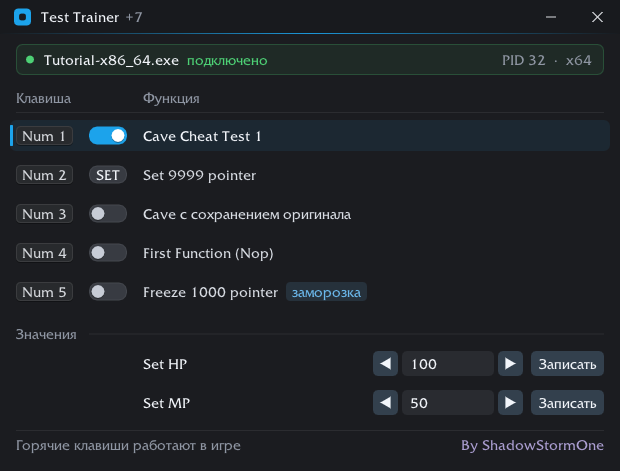

# TrainerForC

Трейнер для игр на C++20: патчи по сигнатурам (NOP, кейвы на ассемблере),
запись и заморозка значений по цепочкам указателей, горячие клавиши,
интерфейс на Dear ImGui + DirectX 11.



- [Сборка](#сборка)
- [Как добавить чит](#как-добавить-чит)
- [Виды патчей](#виды-патчей)
- [От Cheat Engine до готового чита](#от-cheat-engine-до-готового-чита)
- [Поля ввода значений](#поля-ввода-значений)
- [Отладочная консоль](#отладочная-консоль)
- [Тесты](#тесты)
- [Если чит не включается](#если-чит-не-включается)

## Сборка

### Visual Studio

Открыть `TrainerForC++.sln`. Зависимости ставит vcpkg (manifest-режим
или глобально):

```
vcpkg install imgui[dx11-binding,win32-binding,docking-experimental]:x64-windows gtest:x64-windows
```

Подсистема — Windows (`/SUBSYSTEM:WINDOWS`), точка входа `wWinMain`.
asmjit/asmtk, Zydis и stb лежат в `libs/` и собираются вместе с проектом.

### CMake

Без vcpkg: imgui и googletest скачиваются сами.

```
cmake -B build -DCMAKE_BUILD_TYPE=Debug
cmake --build build
build\TrainerTests.exe
```

Кросс-сборка из Linux (mingw-w64), тесты — под wine:

```
cmake -B build -DCMAKE_TOOLCHAIN_FILE=cmake/mingw-w64.cmake -DCMAKE_BUILD_TYPE=Debug
cmake --build build -j
wine build/TrainerTests.exe
```

### Параметры запуска

| Флаг | Что делает |
|---|---|
| `--no-sound` | тихий режим, без звуков включения/выключения |
| `--run-tests` | (только отладочная сборка) прогнать тесты вместо запуска окна |

Имя процесса игры задаётся в `app/main.cpp` (`app.Initialize(L"Game.exe")`).

## Как добавить чит

Все читы описаны в одном файле — `cheats/registry/GameCheats.cpp`. Одна
запись — одна строка в окне. Поля пишутся по именам, ненужные пропускаются:

```cpp
REGISTER_CHEAT({
    .name    = L"Бессмертие",
    .keys    = { VKeys::KEY_NUMPAD1 },
    .patches = { Nop(SIG_TAKE_DAMAGE) },
    .hint    = L"Урон по игроку не проходит",
})
```

| Поле | Что это |
|---|---|
| `.name` | подпись в интерфейсе |
| `.keys` | горячая клавиша или комбинация: `{ VKeys::KEY_CTRL, VKeys::KEY_F1 }` |
| `.patches` | что патчить — один или несколько патчей (см. ниже) |
| `.autoOffMs` | выключить само через столько миллисекунд |
| `.module` | модуль, где искать сигнатуры и от которого считать адреса: `L"GameAssembly.dll"`; `L"*"` — вся исполняемая память (JIT-код Unity/Mono) |
| `.hint` | подсказка при наведении на строку |

Клавишу в название писать не нужно — она рисуется отдельной колонкой.
Сигнатуры удобно держать именованными константами в
`patches/PatchLibrary.h`.

Порядок строк в окне — порядок записей в файле.

## Виды патчей

| Запись | Что делает |
|---|---|
| `Nop(SIG)` | забить NOP-ами одну инструкцию по сигнатуре (длину считает дизассемблер) |
| `Nop(SIG, 6)` | ...или ровно 6 байт |
| `Cave(SIG, Asm("..."))` | кейв: прыжок в выделенную память, там ваш код, прыжок обратно |
| `Cave(SIG, AsmCE("..."))` | то же, но числа как в Cheat Engine — шестнадцатеричные |
| `Cave(SIG, "48 BE E8 03 ...")` | кейв готовыми байтами, как их копирует CE |
| `CaveKeepOriginal(SIG, ...)` | кейв, после кода которого выполняются затёртые оригинальные инструкции |
| `WriteValue(Address, value)` | записать значение один раз (в окне — кнопка `SET`) |
| `Freeze(Address, value)` | держать значение, пока чит включён (как заморозка в CE) |

Модификаторы патчей по сигнатуре:

- `.At(n)` — место патча на `n` байт дальше начала сигнатуры. Сигнатуру
  выгодно брать с запасом *до* нужной инструкции — так она уникальнее.
- `.KeepRegisterChanges()` — не спасать регистры (см. ниже), когда патч
  меняет регистр намеренно и игра должна увидеть новое значение.

### Ассемблер

```cpp
Cave(SIG_DAMAGE, Asm(R"(
    mov rsi, 1000            // комментарии: // до конца строки и { блоком }
    mov [rbx+0x800], rsi
)"))
```

- Инструкции — по строке или через `;`.
- Код собирается при включении, под разрядность игры (x86 или x64).
- **Регистры, в которые пишет патч, кейв спасает сам** (`push`/`pop` вокруг
  вашего кода). Писать их вручную не нужно.
- Для записи в память нужен размер операнда: `mov [rbx+800], 1000`
  неоднозначен, пишите `mov dword ptr [rbx+0x800], 1000` (или `qword`).

`Asm` читает числа как C: `1000` — десятичное, `0x3E8` — шестнадцатеричное.
`AsmCE` — как Cheat Engine, чтобы скрипт из auto-assembler вставлялся без правок:

| В `AsmCE` | Значит |
|---|---|
| `800`, `000003E8`, `800h` | шестнадцатеричное |
| `#1000` | десятичное |
| `(float)100.5` | биты float (`0x42C90000`) |
| `(double)1.5`, `(int)250` | биты double / десятичное целое |

### Адреса значений

Цепочка указателей читается так же, как её показывает Cheat Engine:

```cpp
// "Game.exe"+346C10 -> [+18] -> [+800]
Address::Module(0x346C10).Deref(0x18).Deref(0x800)

// то же одной строкой
Address::Module(0x346C10).Chain({ 0x18, 0x800 })

// от базы другой библиотеки: "UnityPlayer.dll"+1A2B3C -> [+10]
Address::Module(L"UnityPlayer.dll", 0x1A2B3C).Deref(0x10)

// готовый адрес — только для проверки: у динамических значений он
// меняется от запуска к запуску
Address::At(0x7FF6A0001234)
```

Тип значения задаёт размер записи: `9999` — 4 байта int, `1.5f` — float,
`1.5` — double, `std::int64_t{5}` — 8 байт.

## От Cheat Engine до готового чита

1. В Cheat Engine найдите инструкцию («Find out what writes to this address»).
2. Скопируйте байты вокруг неё как AOB (в дизассемблере: *Copy → bytes*).
   Байты, которые меняются от сборки к сборке (смещения, адреса), замените
   на `??`.
3. Проверьте сигнатуру на живой игре: откройте консоль трейнера
   (клавиша `` ` `` в отладочной сборке) и выполните `aob 29 93 ?? ?? 8B ...`.
   Совпадение должно быть **одно**.
4. Если скрипт уже написан в auto-assembler — перенесите тело `newmem:`
   в `AsmCE("...")` как есть. Проверить сборку: `asm ce mov [rbx+800],3E8`.
5. Добавьте запись в `GameCheats.cpp` и прогоните тесты (`--run-tests` или
   `TrainerTests.exe`). Тест `RegistryValidation` без игры проверит, что
   сигнатуры разбираются, ассемблер собирается и клавиши не конфликтуют.

## Поля ввода значений

Строка «подпись — поле — кнопка Записать» под списком читов:

```cpp
REGISTER_VALUE_FIELD(ValueField(L"Золото", Address::Module(0x240600).Deref(0x4B4), 1000))
REGISTER_VALUE_FIELD(ValueField(L"Скорость", Address::Module(0x240600).Deref(0x10), 1.0f))
```

Третий аргумент — значение по умолчанию; его тип задаёт тип поля
(`1000` — целое, `1.0f` — float).

## Отладочная консоль

Открывается клавишей `` ` ``, когда окно трейнера активно (только в
отладочной сборке). Команды:

| Команда | Что делает |
|---|---|
| `aob 29 93 ?? ?? 8B` | найти сигнатуру в игре, показать все совпадения |
| `asm mov qword ptr [rbx+8], 1` | собрать ассемблер, показать байты и разбор |
| `asm ce mov [rbx+800],3E8` | то же в записи Cheat Engine |
| `ptr 346C10 18 800` | пройти цепочку указателей от базы exe |
| `mem 7FF612340000 16` | показать байты по адресу |
| `base [модуль.dll]` | базовый адрес exe или модуля |
| `arch` | разрядность игры |
| `cheats` | список читов и их состояние |
| `status`, `GetPID`, `log`, `clear`, `help` | служебные |

## Тесты

```
TrainerForC++.exe --run-tests          # отладочная сборка Visual Studio
build\TrainerTests.exe                 # CMake
```

Помимо разбора сигнатур, ассемблера и переноса инструкций, тесты ставят
настоящие патчи — кейв, NOP, заморозку — в собственный процесс и проверяют
и результат, и откат байт в байт.

## Если чит не включается

Причина всегда видна: строка мигает красным, появляется уведомление, а
значок `!` справа показывает её при наведении.

| Сообщение | Что делать |
|---|---|
| Сигнатура не найдена | другая версия игры — обновите сигнатуру; или это место уже занято другим включённым читом |
| Сигнатура встречается больше одного раза (в логе) | удлините сигнатуру |
| Адрес не вычислился | цепочка указателей оборвалась — нужный объект ещё не загружен (главное меню, экран загрузки) |
| Нет доступа к игре | игра запущена от администратора — запустите так же и трейнер |
| Ассемблер: ... в строке ... | ошибка в тексте патча; чаще всего не указан `dword ptr`/`qword ptr` |

При закрытии трейнера все включённые читы откатываются. Если игра
закрылась сама, переключатели сбрасываются.
